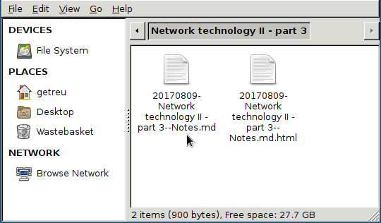
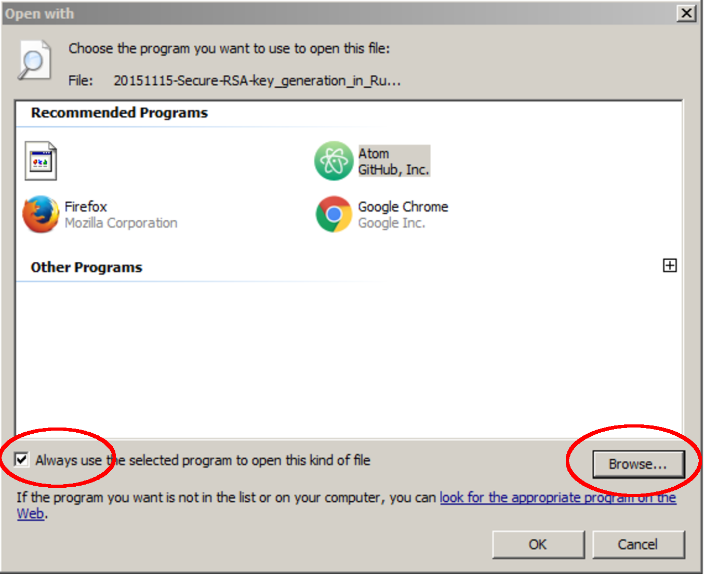

<!-- The YAML header of this document is at the end of the document that it
     overwrites the example headers part of the body text -->


Markup languages like _Markdown_, _ReStructuredText_, _textile_, _txt2tags_ or
_mediawiki_ are perfectly suited for fast note taking. Type your notes with your
favorite editor, using your favorite markup language[^1] and view them with
_Chromium_, _Chrome_ or _Firefox_[^2].

All you need is the `pandoc-note` script, the [Pandoc](http://pandoc.org) format
converter, an editor of your choice and Chromium, Chrome or Firefox as live
previewer.


`pandoc-note` runs under Linux and Windows. The script operates in four modes
depending on it’s options (see [Invoking pandoc-note]):

Create a new note

*   Creates a new context depending notes-plain-text-file with an YAML
    metadata header.

Edit notes

*   Launches an editor and a live-previewer (Firefox, Chrome or Chromium).

View notes

*   Launches a live-previewer (Firefox, Chrome or Chromium).

Sync filename

*   Renames the filename to be in sync with the document’s YAML metadata
    header.

The project is hosted on Github:
[getreu/pandoc-notetaking](https://github.com/getreu/pandoc-notetaking).
The project’s webpage is on
[http://blog.getreu.net](http://blog.getreu.net/projects/pandoc-notetaking/).
There you also find a [pdf rendition](http://blog.getreu.net/_downloads/pandoc-notetaking.pdf)
of this document.

[^1]: `pandoc-note` supports all `Pandoc`'s plain text input formats (see:
      `pandoc --list-input-formats`).  `pandoc-note` guesses the markup language
      from the file extension of the text file. Currently `md`, `markdown`, `mkd`,
      `rst`, `rest`, `txt`, `t2t`, `textile`, `twiki` and `mediawiki` are supported. 

[^2]: As alternative editors with build-in previewer are supported.


**Getting started**  

1.  Read the installation guide for [Linux](#linux) or
    [Windows](#windows).

2.  Read about the 2 most common use cases
    [How students take notes]

# How students take notes

A fellow student still uses paper and pen. I ask her why and she replied
“I can better concentrate. My computer distracts me. I will do all other
things, but not listening.”.

This is certainly true. As I am concerned I am not good at logistics.
For me having all documents and notes in one little machine is a
blessing.

To illustrate how to work with `pandoc-note` here my most common
workflows.

## The lesson starts


{width="60%"}

Alternatively you can open the folder you want to create a new note in
and right-click on some empty white space.

{width="60%"}

{width="100%"}

{width="100%"}

{width="100%"}

{width="60%"}

> **Note**
>
> Before and after launching the editor `pandoc-note` renames the file to
> be in sync with the asciidoc title. For more details see
> [Document title - filename sync]

## Taking notes about a file

{width="70%"}

{width="100%"}

{width="100%"}

{width="60%"}

# Create a new note

There are several ways to launch `pandoc-note`.

Linux

:   -   Launch the commands in shell as described the Section [Invoking
        pandoc-note] below.

    -   Right click on a file or directory in your file-manger and
        choose *pandoc-note* in the context menu. See also
        [Linux file manager configuration].

Windows

:   -   Drag and drop a file or directory on the shortcut
        `pandoc-note.bat` on your desktop.

        This method also works in very restricted environments. The only
        rights you need is to be allowed to execute portable binaries
        and batch scripts. You also need the permission to install the
        _markdown-viewer-webext_ plugin in Chromium, Chrome or
        Firefox.

    -   Double-click the shortcut `pandoc-note.bat` on your desktop. This
        will place a new note on your desktop.

    -   Right click on a file or directory in file explorer and choose
        *pandoc-note* in the context menu. See also
        [Windows file explorer configuration].

## Invoking pandoc-note

``` {.bash}
 pandoc-note -h
```

shows a short help text with available command line options:

    /usr/local/bin/pandoc-note creates, edits or views an markdown note.

    usage:

       /usr/local/bin/pandoc-note [-h][-ro|-so|-eo] | [<File.md>|<Dir>|<File>]

    <Dir>|<File>: directory where the new note file will be created
    (current directory if none).
    If <File> is given a new note file will be created next to that file.
    If <File.md> is given the file is edited.
    Filename of <File> is changed when not in sync with YAML header.

    Options:
    -ro     Do not open editor, open viewer only.
    -eo     Do not open viewer, only new note or, sync filename and edit.
    -so     Do not open editor or viewer, only new note or sync filename.

+-------------+-------------+-------------+-------------+-------------+
| Option      | Create a    | Launch      | Launch      | Sync        |
|             | new note    | editor      | viewer      | title-filen |
|             |             |             |             | ame         |
+=============+=============+=============+=============+=============+
| *without*   | Y \*        | Y           | Y           | Y           |
+-------------+-------------+-------------+-------------+-------------+
| `-ro`       | Y \*        | N           | Y           | N           |
+-------------+-------------+-------------+-------------+-------------+
| `-eo`       | Y \*        | Y           | N           | Y           |
+-------------+-------------+-------------+-------------+-------------+
| `-so`       | Y \*        | N           | N           | Y           |
+-------------+-------------+-------------+-------------+-------------+

Table: `pandoc-note` options

**Lengend:**

Y = yes\
N = no\
\* = If a note with the same filename exists on disk already, no new
note is created.

## Directory as parameter

### Syntax

``` {.bash}
 pandoc-note <path>/<dir>
```

creates the following document:

    <path>/<dir>/YYYYMMDD-<dir>--Notes.md

``` {.markdown}
---
title:    '<dir>'
subtitle: ''
author:   <login name>
date:     <current date>        
revision: 1.0
fileext:  md
---
```

### Example

``` {.bash}
 pandoc-note 'doc/Lecture 1'
```

creates the following document:

    doc/Lecture 1/20170809-Lecture 1--Notes.md

``` {.markdown}
---
title:    'Lecture 1'
subtitle: 'Notes'
author:   getreu
date:     2017-08-09        
revision: 1.0
fileext:  md
---
```

## No parameter


### Syntax

It is also possible to invoke the script without options:

``` {.bash}
 pandoc-note
```

The result is the same as above but the current working directory is
used for `<path>/<dir>`.

### Example

``` {.bash}
 cd 'doc/Lecture 1'
 pandoc-note
```

creates the following document:

    doc/Lecture 1/20170809-Lecture 1--Notes.md

``` {.markdown}
---
title:    'Lecture 1'
subtitle: 'Notes'
author:   getreu
date:     2017-08-09        
revision: 1.0
fileext:  md
---
```

## Filename as parameter


The filename should be some existing local file you want to annotate.
For example I use this feature to note from where I have downloaded a
.pdf.


### Syntax

When invoke with a filename, no date stamp is prepended.

``` bash
 pandoc-note <path>/<dir>/<filename>.<ext>
```

The new file will be created here:

    <path>/<dir>/<filename>.<ext>--Notes.md


And it will look like this:


``` {.markdown}
---
title:    '<filename>.<ext>'
subtitle: 'Notes'
author:   <login name>
date:     <current date>        
revision: 1.0
fileext:  md
---

Annotations on [file](<path>/<dir>/<filename>.<ext>)
```

### Example

``` {.bash}
 pandoc-note 'doc/Implementing the NIST Cybersecurity Framework.pdf'
```

creates the following document

    doc/Implementing the NIST Cybersecurity Framework.pdf--Notes.md

with the content:

``` {.markdown}
---
title:    'Implementing the NIST Cybersecurity Framework.pdf'
subtitle: 'Notes'
author:   getreu
date:     2017-08-09        
revision: 1.0
fileext:  md
---

Annotations on [file](Implementing the NIST Cybersecurity Framework.pdf)
```

Before quitting the `pandoc-note` script executes it’s *editing-mode*.
This opens in your editor the completed template (see example above) and
a live-previewr showing the rendered asciidoc file:

{width="70%"}


# Editing notes

## Syntax


``` {.bash}
  pandoc-note <path>/<filename>.md
```

launches the the `gvim` editor by default. Replace `gvim` by any editor
of your choice. At the same time a `chrome` or `chromium` window will
pop up showing the live rendition of your markdown file.

You may want to use some autosave editor feature in order to observe
changes immediately in the rendered preview live.

Before opening the editor and after closing it, `pandoc-note` calls 
the internal function `SyncFilename`. It guarantees that any change in
the YAML header of the file you have been editing will replicate in
the filename of that markdown file. This guarantees that **the filenames
of markdown notes always correspond to their metadata** allowing
you to find your notes quickly in your directory structure. See
[Document title - filename sync] for more details.


## Example


``` {.bash}
  pandoc-note 'Implementing the NIST Cybersecurity Framework.pdf--Notes.md'
```


The same result is obtained by repeating the same command you used to
create this note [^3]:

``` {.bash}
  pandoc-note 'Implementing the NIST Cybersecurity Framework.pdf'
```

[^3]: This only works if you have not changed the original title of the 
      note file in the meantime!


# Viewing notes


## Syntax

``` {.bash}
  pandoc-note -ro <path>/<filename>.<ext>
```

launches your preferred viewer: `firefox` or `chromium`[^4].

[^4]: `pandoc-note` can be also configured not to use a viewer when your 
      editor has a build in _markdown_-viewer. In this case `-ro` is ignored.


## Example

``` {.bash}
  pandoc-note -ro 'Implementing the NIST Cybersecurity Framework.pdf--Notes.md'
```

{width="70%"}

All text in the above example was automatically generated by the
`pandoc-note` script only the last link *Download pdf* was added “by
hand”. This is particularly useful for quickly writing down the source
of a downloaded document.


# Document title - filename sync

Consider the following note file:

    20151208-Make this world a better place--Suggestions.md

The filename has 4 parts:

    <order mark>-<simplified-title>--<simplified-subtitle>.<ext>

A `<order mark>` can be a

-   *chronological order mark* or

        20140211-
        20151208-

-   *a sequence number order mark*.

        02-
        08-
        09_02-

`<order mark>` can be any combination of `0123456789-_`.

When `pandoc-note` creates a new note based on a directory it prepends a
*chronological order mark* of today. The `<simplified-title>` part is
derived from the parent directory name omitting its own *order mark*.

{width="70%"}

``` {.bash}
  pandoc-note '10-Mein Körper'
```

will result in a new file:

{width="50%"}

    10-Mein Körper/20151209-Mein Körper--Notes.md

> **Note**
>
> The parent directory’s order mark is never used to compose a filename
> for a new note.

When `pandoc-note` creates a new note based on a filename no *order mark*
is prepended.

Before and after editing the `pandoc-note` analyses the `title`, `subtitle` and
`fileext` of the YAML header of the markdown file and simplifies them in a
filesystem friendly form.  If the result does not equal to
`<simplified-title>--<simplified-subtitle>.<ext>` the filename is changed on
disk.  Possible *order marks* remain untouched.


> **Important**
>
> `pandoc-note` might change the note’s filename but never changes an
> *order mark*!

For details about how the metadata is simplified into a
`<simplified-title>--<simplified-subtitle>` string refer to the
`SanitizeFilename()` function in [src/pandoc-note].


# Installation and configuration

`pandoc-note` runs on Linux and Windows. For Windows installation and
configuration see [Windows] below.


## Choose your favorite markup language

### Set the default markup language for new notes

The default markup language for new notes is _Markdown_. To change the default
modify the `DEFAULT_EXT` variable in the `### CONFIGURATION SECTION` of
`pandoc-note`, e.g. `DEFAULT_EXT="rst"` sets the default for new notes to
_ReStructuredText_. Valid values are: `md`, `markdown`, `mkd`, `rst`, `rest`,
`txt`, `t2t`, `textile`, `twiki` and `mediawiki` (cf. Markups variable in
pandoc-note).


### Change the markup language for an existing note

`pandoc-note` determines the markup language by the note's filename extension.
For example `md` means that the note is formatted in _Markdown_.  Like the
filename itself, the filename extension is kept in sync with the document's YAML
metadata header (see Section [Document title - filename sync]).  To change the
markup language for a given note change the value of the `fileext` variable in
the header to a filename extension Pandoc recognizes as input file.  Valid
values are: `md`, `markdown`, `mkd`, `rst`, `rest`, `txt`, `t2t`, `textile`,
`twiki` and `mediawiki` (cf. `Markups` variable in `pandoc-note`).  For example:
in order to switch the markup language from _Markdown_ to _ReStructuredText_,
change `fileext: md` to `fileext: rst`. Be sure to save the note, close the
editor, close the viewer and reopen the note for changes to take effect. Doing
so will change the note's filename extension from `md` to `rst`.

> **Warning**
> 
> Do not change the filename extension manually, as the change will be
> reverted next time you open the note with `pandoc-note`. Instead, change
> the `fileext` variable in the note's header.


## Choose your favorite editor and favorite viewer

### Editor

The editor must be an Unicode text editor. Under Linux every editor will do.
Make sure that your editor does not "fork", meaning that it must block the
invoking shell as long as your are editing. This is the only way for 
`pandoc-note` to know when you finished editing. Most editors work this way,
some like `vim` can be invoked with `vim --no-fork` to achieve this behaviour.

Do not use `Notepad` under Windows as it does not support Unicode. Use 
`Wordpad` instead.

**Configuration Linux**

:   Edit in the `pandoc-note` the `LaunchEditor()` function. 
    Uncomment one choice only.

**Configuration Windows**

:   Edit the file `pandoc-note.bat` and uncomment one example only.


### Live Previewer

The viewer of your choice implies a choice on how you will render _markdown_
into _html_.  You can choose among the following:

 a. Render with _Pandoc_ and view with _Firefox_ (recommended)

    For this work you need to install the following:

        sudo apt-get install pandoc inotify-tools  
                           
    In Firefox install the _auto-reload_ plugin from [here](
    https://addons.mozilla.org/en-US/firefox/addon/auto-reload/).

    This is my preferred solution because you are free to use
    any markup language Pandoc supports, e.g. _ReStructuredText_,
    _Textile_, _MediaWiki_ and many others.

    Currently this solution works only under Linux because it relies on the
    `inotify-tools` package with is not available in _BusyBox_.

 b. Render and wiew with _Firefox_

    In Firefox install the _markdown-viewer-webext_ plugin from [here](
    https://addons.mozilla.org/en-US/firefox/addon/markdown-viewer-webext/).

    The new MIME-type has to be registered in Firefox. This [blog] explains how.

    Optionally you can install viewer plugins for other markup languages
    you want to use, such as [Asciidoctor.js Live Preview](
    https://addons.mozilla.org/en-US/firefox/addon/asciidoctorjs-live-preview/).
    

    [blog]: https://superuser.com/questions/696361/how-to-get-the-markdown-viewer-addon-of-firefox-to-work-on-linux    


  c. Render and view with _Chrome_ or _Chromium_[^5]

     Install the following package

         sudo apt-get install uni2ascii

     \[section pending\]


  d. Do no use a browser as previewer but use the editor's build-in previewer
     instead

     Some editors have a build-in previewer like [ReText](
     https://github.com/retext-project/retext). For the
     [Atom-editor](https://atom.io/) plug-ins for _Markdown_, _Asciidoc_, and
     _ReStructuredText_ are available.
     
[^6]: At the time of this writing only `chromium` and `chrome` refresh
      automatically and can be launched in application interface mode.


**Configuration Linux**

:   Edit in the `pandoc-note` the `LaunchViewer()` function. 
    Uncomment one choice only.

**Configuration Windows**

:   Edit the file `pandoc-note.bat` and uncomment one example only.

## Linux

#.  Install an [Editor] and a [Live previewer] of your choice (see above).


#.  Download the note-taking-script `bin/pandoc-note` from Github
    [getreu/pandoc-notetaking](https://github.com/getreu/pandoc-notetaking).
    Alternatively you can copy and paste the listing at end of this
    document.

#.  Copy it in a location of your `$PATH` and make it executable for
    everyone.

    ``` {.bash}
      sudo cp pandoc-note /usr/local/bin
      sudo chmod a+rx /usr/local/bin/pandoc-note
    ```


#.  Configuration:

    At the beginning of `pandoc-note` you will find a section enclosed in
    the commments `CONFIGURATION SECTION START` and
    `CONFIGURATION SECTION END`.

    Here you can specify what editor you want to use, if you choose
    `firefox`, `chrome` or `chromium` and you can specify the parameters
    these programs require. Make sure that your editor does not fork
    when launched. If it does fork, the script will still work but when
    you quit, no asciidoc-title-filename sync will occur. Outside the
    `CONFIGURATION SECTION` no changes should be necessary.

    > **Warning**
    >
    > The environment variables `PANDOC_EDITOR` or `PANDOC_VIEWER` -when
    > set- have precedence over settings in the
    > `CONFIGURATION SECTION` and will override them.

    See the Section [Editor] and the Section [Live previewer] for details.
    

#.  Test the installation: open a console window and type `pandoc-note`.
    An *editor* and *viewer* window containing a note template should
    open.

#.  Optional: integrate the scripts with your file-manager (see
    [Linux file manager configuration]).


## Windows


#.  Install an [Editor] and a [Live previewer] of your choice (see above).
    

#.  Download the the files `bin/pandoc-note`, `bin/pandoc-note.bat` and
    `bin/busybox.exe` from Github
    [getreu/markdown-notetaking](https://github.com/getreu/markdown-notetaking).
    Alternatively you can copy and paste the listings at end of this
    document. The version of `busybox` in the above repository is
    outdated. Download the _BusyBox_ executable 
    [busybox.exe](http://frippery.org/files/busybox/busybox.exe).

#.  Copy the 3 files in a directory of your choice. In the following I
    call this directory *BIN\_DIR*.

#.  Configuration:

    At the beginning of `pandoc-note.bak` you will find a section enclosed
    in the commments `CONFIGURATION SECTION START` and
    `CONFIGURATION SECTION END`.

    > **Note**
    >
    > The only file you edit to change the default choices for *editor*
    > and *viewer* under Windows is `adco-note.bat`. **Not**
    > `pandoc-note`!

    > **Important**
    >
    > New notes are created with an Unicode BOM indicating Unicode
    > encoding. Do not use the `notepad` editor as it does not
    > understand Unicode. Use `Wordpad` or and other modern Unicode
    > editor instead.

    Here you can specify what browser you want to use, e.g. if you
    choose `firefox.exe` or `chromium.exe` and you can specify the
    parameters these programs require. Do the same for the editor of
    your choice. Make sure that your editor does not fork when launched.
    If it does fork, the script will still work but when you quit, no
    asciidoc-title-filename sync will occur. Outside the
    `CONFIGURATION SECTION` no changes should be necessary.

    See the Section [Editor] and the Section [Live previewer] for details.
 

6.  Create a shortcut to `pandoc-note.bat` on your desktop, click on
    properties and change the shortcut to *run minimized*. Let the
    *start in* path empty.

    {width=60%}

7.  Test the installation: drag a file or directory on the
    `pandoc-note Shortcut` on your desktop. An *editor* and *viewer*
    window should open.

8.  Optional: integrate the scripts with your file-manager (see
    [Windows file explorer configuration]).


## Integration with file manager

This section shows how to integrate `pandoc-note` with your file manager.


### Linux file manager configuration

The example below shows the *Thunar* filebrowser’s custom actions.

{width="80%"}

Most file-manager allow extending the context menu. As an example the
following images show the configuration of the Thunar-file-manger.

{width="60%"}

{width="60%"}

{width="60%"}

### Windows file explorer configuration

1.  Open a folder containing an `.md` file.

2.  Right-click the `.md` file and point to *Open with* and then click
    *Choose default program*.

    {width="100%"}

3.  Select the *Always use the selected program* and then click
    *Browse…​*.

    {width="70%"}

4.  Click *Browse…​* then browse to your *BIN\_DIR* directory, select
    `pandoc-note.bak` and click *Open* and later *Ok*.

    {width="70%"}

Further reading:

-   [Change the program that opens a type of
    file](http://windows.microsoft.com/en-us/windows/change-file-open-program#1TC=windows-7)

-   [How to Add Any Application Shortcut to Windows Explorer’s Context
    Menu](http://www.howtogeek.com/107965/how-to-add-any-application-shortcut-to-windows-explorers-context-menu/).


---
title: 'Note taking with Pandoc'
subtitle: 'Organize your notes with your favorite editor and markup-language'
author: Jens Getreu
date: 9.8.2017
version: v1.1
file-ext: md
lang: en
---

